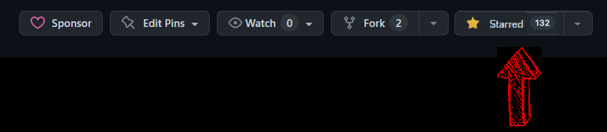

[](https://github.com/ILoveDotNet/ilovedotnet/actions/workflows/build-blazor-app.yml)

# I ❤️ .NET

This is a .NET knowledge sharing platform with live demos crafted by developers for developers with love using .NET. The goal is to make sure this learning platform helps developers to up and run .NET easily in their projects. This platform will cover minimal knowledge, steps, content needed to start with .NET stack.


# Announcement

This is knowledge sharing platform maintained by [Microsoft MVP](https://mvp.microsoft.com/en-US/MVP/profile/b177819f-95fb-ed11-8f6d-000d3a560942) - [Abdul Rahman](https://linkedin.com/in/thebhai). I document and write each and every piece of my knowledge in dotnet development which I gained over a decade working in multiple complex projects. Mastering the contents in this blog will transform anyone from zero to hero in dotnet. All you need to do is to invest your time.

# Sponsors
If you want to support my project and help me grow it, you can <a href="https://www.buymeacoffee.com/thebhai" target="_blank"></a> or [become a sponsor on GitHub](https://github.com/sponsors/fingers10) or just [donate on PayPal](https://www.paypal.com/paypalme/arsmtb) and your logo will show up here with a link to your website :)

# Please help by giving a ⭐
We appreciate your ⭐. It Helps!! That will not only help strengthen our .NET community but also improve development skills for .NET developers in around the world. Thank you very much 👍. 

Choosing a project idea could be difficult. We need to ensure stability and maintainability of our projects. Surveys show that GitHub stars count play an important factor when assessing quality.

⭐ Please give this repository a star. It takes seconds and help thousands of developers! ⭐


# Road Map
1. [Blazor WASM](https://github.com/orgs/ILoveDotNet/projects/2)
2. [LINQ](https://github.com/orgs/ILoveDotNet/projects/6)
3. [Entity Framework](https://github.com/orgs/ILoveDotNet/projects/4)
4. [C#](https://github.com/orgs/ILoveDotNet/projects/5)
5. [ML.NET](https://github.com/orgs/ILoveDotNet/projects/3)
6. [WEB API](https://github.com/orgs/ILoveDotNet/projects/8)
7. [DSA](https://github.com/orgs/ILoveDotNet/projects/7)
8. [Design Patterns](https://github.com/orgs/ILoveDotNet/projects/9)
9. [TDD](https://github.com/orgs/ILoveDotNet/projects/10)
10. [String Builder](https://github.com/orgs/ILoveDotNet/projects/11)
11. [Regex](https://github.com/orgs/ILoveDotNet/projects/12)
12. [OOPS](https://github.com/orgs/ILoveDotNet/projects/13)
13. [Expression Trees](https://github.com/orgs/ILoveDotNet/projects/14)
14. [Swagger](https://github.com/orgs/ILoveDotNet/projects/15)
15. [Middlewares](https://github.com/orgs/ILoveDotNet/projects/16)
16. [JWT](https://github.com/orgs/ILoveDotNet/projects/17)
17. [Dependency Injection](https://github.com/orgs/ILoveDotNet/projects/18)
18. [Minimal API](https://github.com/orgs/ILoveDotNet/projects/20)
19. [CLI](https://github.com/orgs/ILoveDotNet/projects/21)
20. [HTTP Client](https://github.com/orgs/ILoveDotNet/projects/22)
21. [Report](https://github.com/orgs/ILoveDotNet/projects/23)
22. [Concurrency](https://github.com/orgs/ILoveDotNet/projects/24)
23. [SOLID](https://github.com/orgs/ILoveDotNet/projects/25)
24. [Background Services](https://github.com/orgs/ILoveDotNet/projects/26)
25. [OWASP Secure Coding](https://github.com/orgs/ILoveDotNet/projects/27)
26. [SignalR](https://github.com/orgs/ILoveDotNet/projects/28)
27. [MSBuild](https://github.com/orgs/ILoveDotNet/projects/30)
28. [MAUI](https://github.com/orgs/ILoveDotNet/projects/32)
29. [Testing](https://github.com/orgs/ILoveDotNet/projects/33)
30. [AI](https://github.com/orgs/ILoveDotNet/projects/34)
31. [Security](https://github.com/orgs/ILoveDotNet/projects/35)
32. [JSON](https://github.com/orgs/ILoveDotNet/projects/36)

# Please share with the community
As an open-source project without funding, I cannot afford advertising I ❤️ .NET in a typical way. Instead, the project relies on community interactions. Please consider sharing a post about I ❤️ .NET and the value it provides. It really does help!

# Our Official Network
| Platform  | Link                                      | Status                                                                                                                                                                                                                               |
|-----------|-------------------------------------------|--------------------------------------------------------------------------------------------------------------------------------------------------------------------------------------------------------------------------------------|
| Website   | https://ilovedotnet.org                   | [](https://ilovedotnet.org)                                                                   |
| YouTube   | https://youtube.com/@ilovedotnet		    | [](https://youtube.com/@ilovedotnet)                      |
| LinkedIn  | https://linkedin.com/groups/9083706/      | [](https://www.linkedin.com/groups/9083706/) |
| Instagram | https://instagram.com/ilovedotnet/        | [](https://instagram.com/ilovedotnet/)                 |
| WhatsApp  | https://www.whatsapp.com/channel/0029VaAGMV2LtOj5S5MHd23h      | [](https://whatsapp.com/channel/0029VaAGMV2LtOj5S5MHd23h)

# Contribution Guidelines
1. You can contribute for any of the channels mentioned in road map. If the channel you wish to contribute is not available then you can add channel to road map and contribute. 
2. In any channel make sure the topic you wish to cover doesn't exists already. If it exists already please review the content and try to update it.
3. If the channel is closed and you wish to add new content the please raise an PR with the content and we will review it.
4. A live working demo would be preferred in all content.
5. Try to keep content simple and short.
6. Any ideas to improve content are welcome.

# Star History (THANK YOU SO MUCH ❤️)
[](https://star-history.com/#ILoveDotNet/ilovedotnet&Date)

# Test Coverage 

To see test coverage for tests you've written, you can use the default [**coverlet**](https://github.com/coverlet-coverage/coverlet) tool that is included with the `XUnit` test project template.

```bash
dotnet test --collect:"XPlat Code Coverage"
```

Then use the [**reportgenerator**](https://github.com/danielpalme/ReportGenerator) global tool to generate an HTML report.  To install the tool
(you only need to do this once):

```bash
dotnet tool install --global dotnet-reportgenerator-globaltool
```

Then run the following command to generate the report:

```bash
reportgenerator -reports:".\UITests\TestResults\**\coverage.cobertura.xml" -targetdir:"coverage" -reporttypes:Html
```
To remove any contents from previous runs, use the following PowerShell command:

```bash
gci -include TestResults,coverage -recurse | remove-item -force -recurse
```

# CI/CD Pipeline

Our continuous integration and deployment pipeline automates building, testing, and deploying the ILoveDotNet application. 
The pipeline is implemented using GitHub Actions and is defined in `.github/workflows/build-blazor-app.yml`.

## Workflow Triggers

The CI/CD pipeline can be triggered in several ways:
- **Push to main**: Automatically runs when changes are pushed to the main branch (excluding markdown files)
- **Pull Requests**: Runs on pull requests targeting the main branch
- **Weekly Schedule**: Runs every Sunday at 17:00 UTC to ensure dependencies are up-to-date
- **Manual Trigger**: Can be manually triggered through the GitHub Actions interface

## Pipeline Visualization

The following diagram illustrates the complete CI/CD workflow:


## Workflow Structure

The ILoveDotNet CI/CD pipeline uses a single comprehensive job that handles all aspects of the build, test, and deployment process. This design choice provides several advantages:

1. **Simplified Dependency Management**: All steps share the same environment and workspace
2. **Sequential Execution Control**: Each phase (setup, build, test, deploy) runs in a controlled order
3. **Consolidated Logging**: All related logs appear in a single job context for easier troubleshooting
4. **Resource Efficiency**: No duplicate checkout or setup steps required across multiple jobs

The workflow includes conditional deployment logic to ensure GitHub Pages is only updated when appropriate conditions are met:
- Deployments only occur on pushes to the main branch (not pull requests)
- Deployments are skipped for automated dependency updates from Dependabot
