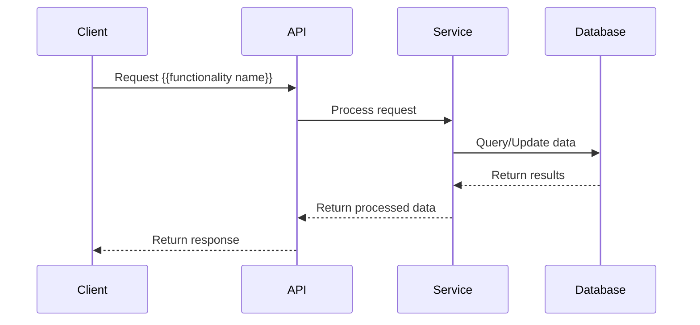
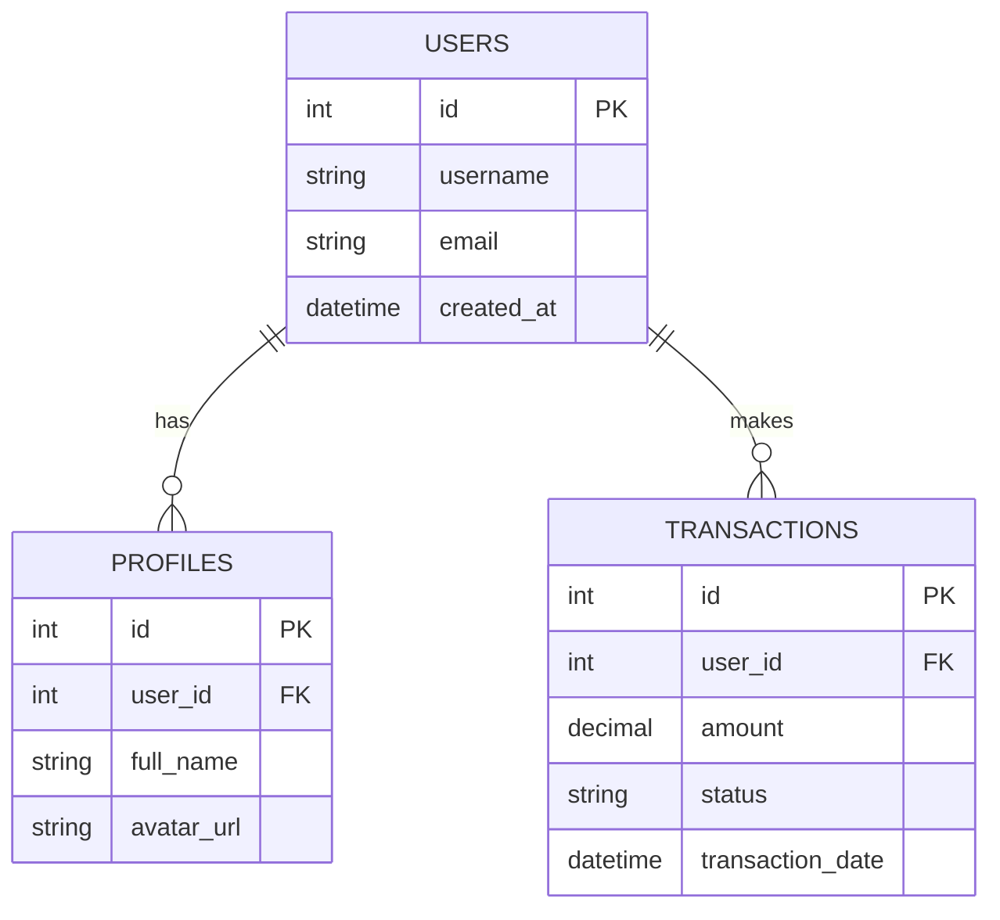

# Dependency Mapping and Code Path Tracing Guide

## Overview
This guide provides a structured approach to understand how a specific functionality works in a codebase, map its dependencies, and visualize its workflow, including database schema analysis using PostgreSQL extensions.

## Instructions

### Before You Begin
1. **Confirm Understanding**: Before proceeding with any analysis, confirm that you understand what functionality you're investigating.
2. **Save State Regularly**: To avoid timeout issues, save your progress after completing each major section.
3. **Error Recovery**: If an error occurs, the system will automatically continue from where you left off.
4. **Set up Database Tools**: If your analysis requires database inspection, ensure the PostgreSQL extension is installed and configured.

## Part 1: Tracing Code Paths

### PERSONA
As a software architect analyzing a new codebase...

### INSTRUCTIONS
...trace and document the execution path of the specified functionality by examining relevant files and code structures...

### INPUT CONTENT
...using the codebase files and search functionality to identify the components involved in {{functionality name}}...

### FORMAT
...create a clear, hierarchical breakdown with both high-level overviews and detailed function maps.

### ADDITIONAL INFORMATION
Focus on understanding the flow of data and control through the system, from API Endpoint to backend processing and database operations.

### Steps to Follow:

1. **Initial File Examination**:
   ```
   #file:file-name Show me how the {{functionality name}} functionality works
   ```

2. **High-Level Overview**:
   ```
   @workspace /explain Show me how the {{functionality name}} functionality works. Just give me the high-level details.
   ```

3. **Detailed Workflow Summary**:
   ```
   #file:file-name Generate a summary of the entire {{functionality name}} workflow in the UI. I'm most interested in the function names, their input, output and how they call each other to get to the API call.
   ```

4. **Create Structured Breakdown**:
   ```
   Give me the workflow breakdown in a bulleted list with groups like:
   - group
     - method
     - reason etc
   ```

5. **Generate ASCII Diagram Map**:
   ```
   Create a Markdown file called {{functionality name}}_map.md which contains an ASCII diagram of the functions used and their relationships when {{functionality name}}. Use the above as context if needed.
   ```

## Part 2: Dependency Mapping

### PERSONA
As a systems integrator mapping component dependencies...

### INSTRUCTIONS
...identify all dependencies and connections between components involved in the {{functionality name}} functionality...

### INPUT CONTENT
...examining API endpoints, controllers, services, and package references in the codebase...

### FORMAT
...create progressively more detailed diagrams showing the relationships between components.

### ADDITIONAL INFORMATION
Pay special attention to external dependencies and how data flows through the system architecture.

### Steps to Follow:

1. **API Endpoint Identification**:
   ```
   Find the code that triggers the external API endpoint that receives {{functionality name}} requests from the frontend and update the {{functionality name}} map's ASCII diagram to show the function and endpoint.
   ```

2. **Backend Component Analysis**:
   ```
   In the backend, what components are involved in accepting the API request and routing it to the database? I'm providing you with context of {{functionality name}} service. Use it to understand the code and update the {{function name}} journey #file:file-name
   ```

3. **Verification**:
   ```
   Look at the code yourself and double check.
   ```

4. **Package Dependency Discovery**:
   ```
   Please look at each of the backend components in the code and discover the package dependencies for each. You can reference the nuget package reference inside .csproj if you need to. When you discover them, update each box in the {{functionality name}} map diagram to include what packages each component needs to operate.
   ```

5. **UML Diagram Creation**:
   ```
   Generate a UML diagram showing the full dependency tree for the {{functionality name}}.
   Include:
   - Routes
   - Controllers
   - Services
   - External npm/nuget packages
   - Relationships between components
   Use PlantUML syntax.
   ```

6. **Sequence Diagram**:
   ```
   Include sequence diagram using mermaid syntax and validate the syntax.
   ```

## Example Mermaid Sequence Diagram Template



## Example Database Entity Relationship Diagram Template



## Confirmation and Checkpoints

After completing each major section:
1. Confirm findings and understanding before proceeding to the next step
2. Save the current state of your analysis to prevent data loss
3. If interrupted, resume from the last checkpoint

## Part 3: PostgreSQL Database Analysis

### PERSONA
As a database analyst examining the data structure supporting the application...

### INSTRUCTIONS
...analyze the database schema and relationships that underpin the {{functionality name}} functionality...

### INPUT CONTENT
...using PostgreSQL extension tools to connect to the database and examine relevant tables, views, and stored procedures...

### FORMAT
...create comprehensive documentation of the database structure with entity relationship diagrams and data flow visualizations.

### ADDITIONAL INFORMATION
Focus on understanding how data is stored, retrieved, and transformed to support the functionality, including performance considerations and query patterns.

### Setup PostgreSQL Extension

1. **Install the PostgreSQL Extension**:
   ```
   1. Open VS Code extensions panel (Ctrl+Shift+X)
   2. Search for "PostgreSQL"
   3. Install the PostgreSQL extension by Microsoft
   4. Reload VS Code if prompted
   ```

2. **Configure PostgreSQL Connection**:
   ```
   1. Open Command Palette (Ctrl+Shift+P)
   2. Type "PostgreSQL: Add Connection" and select it
   3. Enter your database connection details:
      - Host: [database host]
      - Port: [port number, typically 5432]
      - Username: [your database username]
      - Password: [your database password]
      - Database: [database name]
   4. Save the connection with a descriptive name
   ```

### Steps to Follow:

1. **Connect and Explore the Database**:
   ```
   @pgsql Tell me about the database structure related to {{functionality name}}
   ```

2. **Identify Key Tables**:
   ```
   @pgsql What tables are used by the {{functionality name}} feature?
   ```

3. **Understand Table Relationships**:
   ```
   @pgsql Show me the relationships between tables used in {{functionality name}}
   ```

4. **Analyze Data Flow**:
   ```
   @pgsql How does data flow through the database during the {{functionality name}} process?
   ```

5. **Examine Key Queries**:
   ```
   @pgsql What are the most important queries used by {{functionality name}}?
   ```

6. **Visualize Database Schema**:
   ```
   @pgsql Create a visualization of the database schema for {{functionality name}}
   ```

7. **Identify Performance Bottlenecks**:
   ```
   @pgsql Are there any performance issues in the database related to {{functionality name}}?
   ```

8. **Generate Comprehensive Documentation**:
   ```
   Create a Markdown file called {{functionality name}}_database.md that documents the database structure, 
   relationships, and query patterns supporting this functionality
   ```

9. **Update Architecture Map**:
   ```
   Update the main architecture diagram to include the database components used by {{functionality name}}
   ```

## Final Verification

Before concluding the analysis:
1. Verify all components have been identified
2. Ensure all diagrams accurately represent the system
3. Check that all package dependencies are correctly documented
4. Validate the syntax of all diagrams
5. Confirm that database tables and relationships are accurately mapped
6. Verify query patterns align with the application's code patterns
