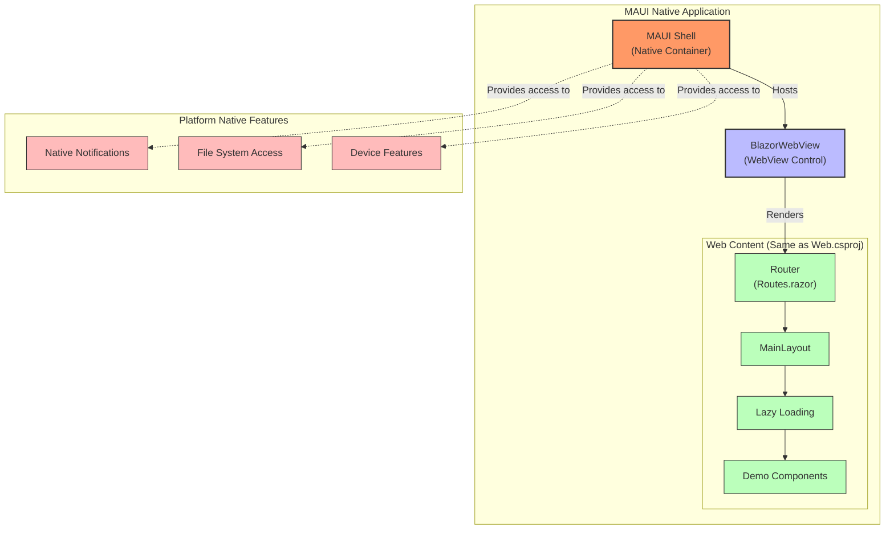
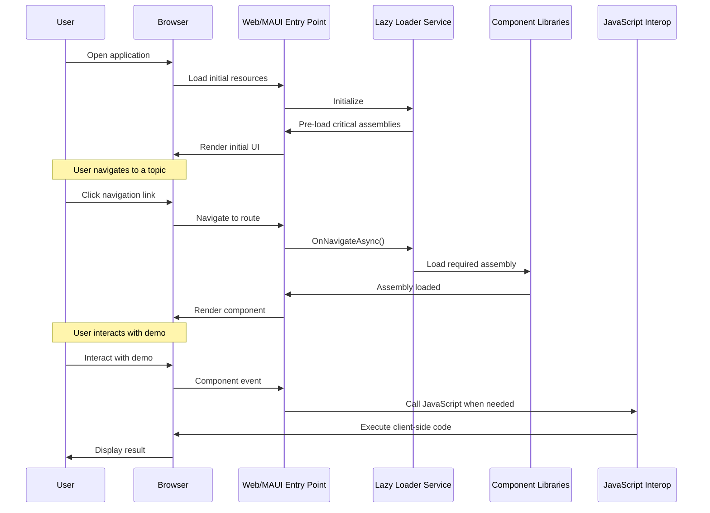
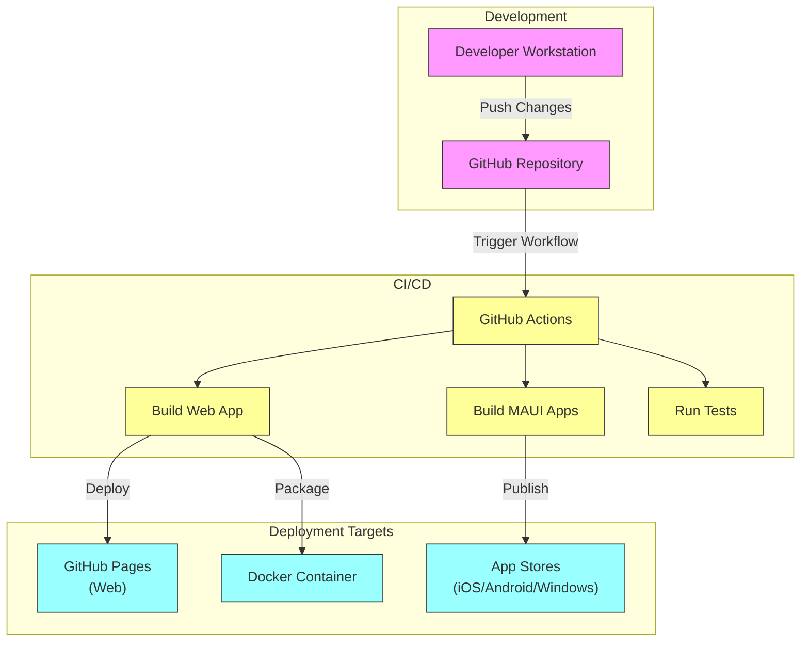

# ILoveDotNet Application Architecture

This document provides a visual representation of the ILoveDotNet application architecture using Mermaid diagrams.

## Project Structure

The following diagram illustrates the high-level project structure and relationships between the main components:

```mermaid
graph TB
    subgraph "Entry Points"
        Web["Web Project<br>(Blazor WASM)"]
        MAUI["MAUI Project<br>(Cross-platform native app)"]
    end

    subgraph "Core Components"
        BaseComponents["BaseComponents<br>(Core UI elements)"]
        CommonComponents["CommonComponents<br>(Shared UI elements)"]
        SharedComponents["SharedComponents<br>(Utility components)"]
        SharedModels["SharedModels<br>(Data models)"]
    end

    subgraph "Demo Components" 
        BlazorDemo["BlazorDemoComponents"]
        LINQDemo["LINQDemoComponents"]
        DIDemoComponents["DependencyInjectionDemoComponents"]
        DesignPatternDemo["DesignPatternDemoComponents"]
        OOPSDemo["OOPSDemoComponents"]
        RegexDemo["RegexDemoComponents"]
        ReportDemo["ReportDemoComponents"]
        HTTPDemo["HTTPClientDemoComponents"]
        MiddlewareDemo["MiddlewareDemoComponents"]
        MLNETDemo["MLNETDemoComponents"]
        WebAPIDemo["WebAPIDemoComponents"]
        MAUIDemo["MAUIDemoComponents"]
        MSBuildDemo["MSBuildDemoComponents"]
        OWASPDemo["OWASPDemoComponents"]
        SignalRDemo["SignalRDemoComponents"]
        SOLIDDemo["SOLIDDemoComponents"]
        TDDDemo["TDDDemoComponents"]
        TestingDemo["TestingDemoComponents"]
        PythonDemo["PythonDemoComponents"]
        TalkDemo["TalkDemoComponents"]
    end

    subgraph "Utilities"
        RSSFeedGenerator["RSS Feed Generator"]
        SitemapGenerator["Sitemap Generator"]
        UITests["UI Tests"]
    end

    %% Connections between components
    Web --> BaseComponents
    Web --> CommonComponents
    Web --> SharedComponents
    Web --> SharedModels
    Web --> BlazorDemo
    Web --> LINQDemo
    Web --> DIDemoComponents
    Web --> DesignPatternDemo
    Web --> OOPSDemo
    Web --> RegexDemo
    Web --> ReportDemo
    Web --> HTTPDemo
    Web --> MiddlewareDemo
    Web --> MLNETDemo
    Web --> WebAPIDemo
    Web --> MAUIDemo
    Web --> MSBuildDemo
    Web --> OWASPDemo
    Web --> SignalRDemo
    Web --> SOLIDDemo
    Web --> TDDDemo
    Web --> TestingDemo
    Web --> PythonDemo
    Web --> TalkDemo

    MAUI --> BaseComponents
    MAUI --> CommonComponents
    MAUI --> SharedComponents
    MAUI --> SharedModels
    MAUI --> BlazorDemo
    MAUI --> LINQDemo
    MAUI --> DIDemoComponents
    MAUI --> DesignPatternDemo
    MAUI --> OOPSDemo
    MAUI --> RegexDemo
    MAUI --> ReportDemo
    MAUI --> HTTPDemo
    MAUI --> MiddlewareDemo
    MAUI --> MLNETDemo
    MAUI --> WebAPIDemo
    MAUI --> MAUIDemo
    MAUI --> MSBuildDemo
    MAUI --> OWASPDemo
    MAUI --> SignalRDemo
    MAUI --> SOLIDDemo
    MAUI --> TDDDemo
    MAUI --> TestingDemo
    MAUI --> PythonDemo
    MAUI --> TalkDemo

    %% Layout control
    classDef entryPoint fill:#f96,stroke:#333,stroke-width:2px
    classDef coreComponent fill:#bbf,stroke:#333,stroke-width:1px
    classDef demoComponent fill:#bfb,stroke:#333,stroke-width:1px
    classDef utility fill:#fbb,stroke:#333,stroke-width:1px

    class Web,MAUI entryPoint
    class BaseComponents,CommonComponents,SharedComponents,SharedModels coreComponent
    class BlazorDemo,LINQDemo,DIDemoComponents,DesignPatternDemo,OOPSDemo,RegexDemo,ReportDemo,HTTPDemo,MiddlewareDemo,MLNETDemo,WebAPIDemo,MAUIDemo,MSBuildDemo,OWASPDemo,SignalRDemo,SOLIDDemo,TDDDemo,TestingDemo,PythonDemo,TalkDemo demoComponent
    class RSSFeedGenerator,SitemapGenerator,UITests utility
```

## MAUI WebView Architecture

The following diagram illustrates how MAUI.csproj uses BlazorWebView to render the same web content as the Web.csproj project but inside a native shell:

## Component Interaction and Lazy Loading

The following sequence diagram illustrates how components interact and the lazy loading mechanism:

## Deployment Architecture

The following diagram shows the deployment process and targets:

## Key Architectural Characteristics

1. **Modular Design**: The application is structured into multiple component libraries, each focusing on a specific aspect of .NET technology.

2. **Dual Entry Points**: 
   - **Web Project (Blazor WASM)**: For browser-based access
   - **MAUI Project**: For native application access across multiple platforms (iOS, Android, macOS, Windows)
   - **MAUI as a Shell**: The MAUI project uses BlazorWebView to render the same Blazor WASM components as the Web project but inside a native application shell, providing access to native platform features while maintaining a unified codebase

3. **Lazy Loading**: Components are loaded on-demand to optimize initial load time and performance.

4. **Shared Component Model**: Both entry points share the same component libraries, maximizing code reuse.

5. **JavaScript Interoperability**: Uses JSInterop for browser-native functionality when needed.

6. **Responsive Design**: Adapts to different screen sizes and platforms.

7. **CI/CD Integration**: Automated build and deployment through GitHub Actions.

8. **Testing**: Includes UI testing capabilities for ensuring quality.

## Component Types

1. **Core Components**: Basic building blocks used across the application
   - BaseComponents
   - CommonComponents
   - SharedComponents
   - SharedModels

2. **Demo Components**: Topic-specific components that demonstrate various .NET technologies
   - BlazorDemoComponents
   - LINQDemoComponents
   - DependencyInjectionDemoComponents
   - Many others (20+ topic areas)

3. **Utilities**: Supporting tools and services
   - RSSFeedGenerator
   - SitemapGenerator
   - UITests

## Technical Implementation

- **Language**: C# with Razor components
- **Framework**: .NET 9.0 with Blazor WebAssembly and .NET MAUI
- **Styling**: CSS with custom classes
- **JavaScript Integration**: Module-based JS isolation
- **Testing**: XUnit with coverage reporting
- **MAUI Implementation**: Uses BlazorWebView to host the same web components as the Web project inside a native shell, providing a unified experience with native platform capabilities
